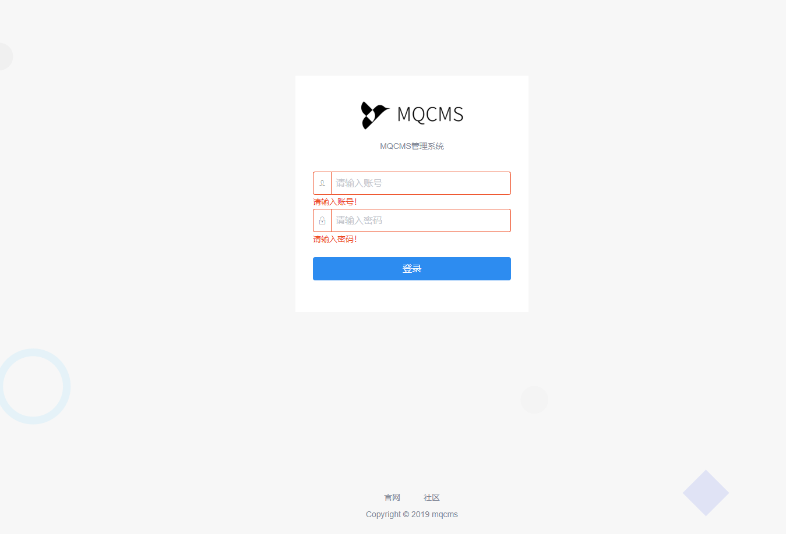
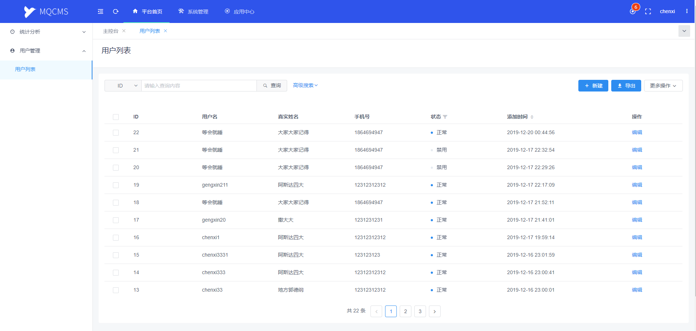
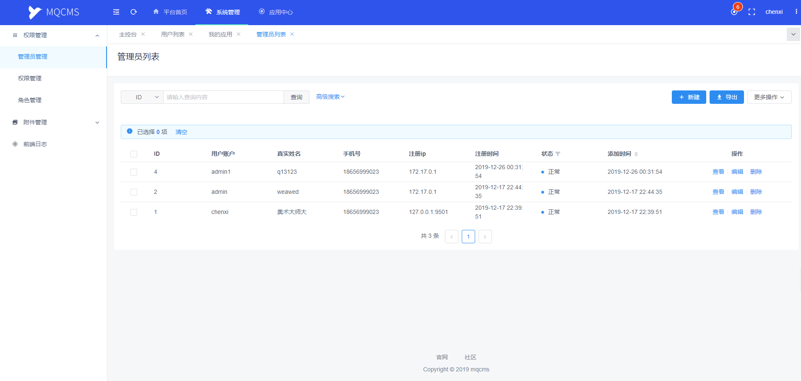
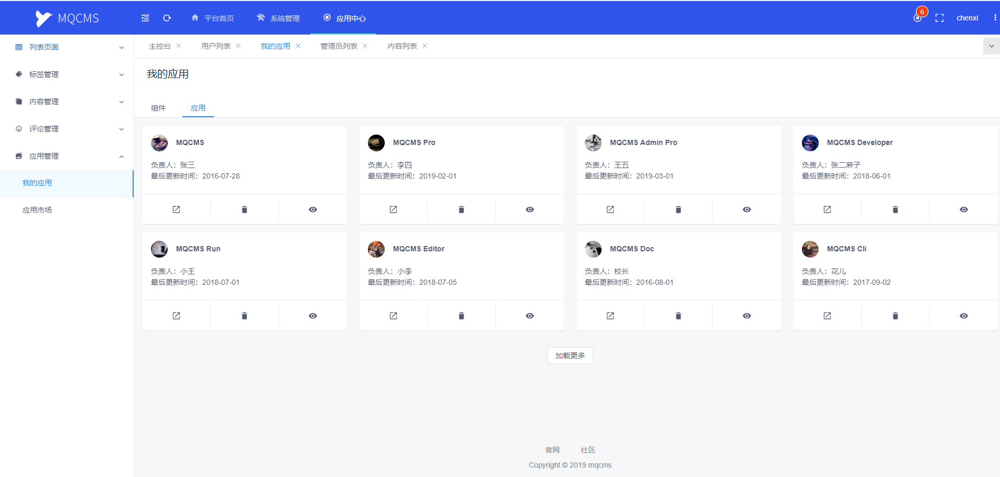

# MQCMS
[](https://github.com/MQEnergy/MQCMS)
[](https://github.com/MQEnergy/MQCMS)

MQCMS是一款现代化，快速，高效，灵活，前后端分离，扩展性强的CMS系统。
MQCMS中的MQ取麻雀拼音首字母。寓意麻雀虽小五脏俱全。
### 特别感谢
本项目基于hyperf框架开发的应用，感谢hyperf的作者提供了这么优秀的框架

目前正在基于MQCMS做中科大项目，待中科大项目完成，会有相应组件和功能补充到MQCMS项目上，会让MQCMS更健壮，敬请期待。。。
（言外之意，MQCMS进度会慢 😭）

### 开发文档
文档正在路上...

前端项目仓库：
https://github.com/MQEnergy/MQCMS-admin

demo访问：
[http://mrw.so/54t10i](http://mrw.so/54t10i)（账号密码：demo/123456）

### 应用截图
#### 1、登录页面

#### 2、平台首页

#### 3、系统管理

#### 4、应用中心


### 本地开发
在docker环境下开发，window10环境安装`docker desktop for window`,
window10以下环境安装`docker toolbox`。


##### 下载hyperf框架docker镜像
```
docker pull hyperf/hyperf
```


##### 下载mqcms系统到本地
```
# 例如：将项目放在本地e:/web/MQCMS
git clone https://github.com/MQEnergy/MQCMS
```

##### 进入docker运行命令：
```
docker run -it -v /e/web/MQCMS:/mqcms -p 9501:9501 --name mqserver --entrypoint /bin/sh hyperf/hyperf
```

##### 将Composer镜像设置为阿里云镜像，加速国内下载速度
```
php mqcms/bin/composer.phar config -g repo.packagist composer https://mirrors.aliyun.com/composer
```

##### docker安装redis
```
docker pull redis
# 进入redis 配置redis可外部访问

docker run -d --privileged=true -p 6379:6379 -v /e/web/MQCMS/docker/conf/redis/redis.conf:/etc/redis/redis.conf --name mqredis redis redis-server /etc/redis/redis.conf --appendonly yes
docker exec -it mqredis /bin/sh

# 修改映射在本地的redis.conf
# 修改bind如下（根据自己熟悉程度配置）
# bind 0.0.0.0

# 可开启password（自行按需修改）
# requirepass foobared

# 重启redis
docker restart mqredis
```

##### 进入项目安装依赖启动项目
```
docker exec -it mqserver /bin/sh
cd mqcms
php bin/composer.phar install
cp .env.example .env
php bin/hyperf.php migrate
php bin/hyperf.php start 或者 php watch (热更新)
```

##### 浏览器访问项目
```
http://127.0.0.1:9501
{
    "method": "GET",
    "message": "Hello MQCMS"
}
```

### 扩展功能
#### command命令扩展
1、创建service
```
# 查看mq:service命令帮助
php bin/hyperf.php mq:service --help

# 创建App\Service命名空间的service
php bin/hyperf.php mq:service FooService Foo
# FooAdminService：service名称 FooAdmin：model名称
 
# 创建其他命名空间的service
php bin/hyperf.php mq:service -N App\\Service\\Admin FooAdminService FooAdmin
# FooAdminService：service名称 FooAdmin：model名称
 
```

2、创建controller
```
# 查看mq:controller命令帮助
php bin/hyperf.php mq:controller --help

# 创建App\Controller命名空间的controller
php bin/hyperf.php mq:controller FooController FooService admin
# FooController：controller名称 FooService：service名称 admin：模块名称（后台，接口 可扩展，eg.可写成：Admin ADMIN admin ...）

# 创建其他命名空间的controller
php bin/hyperf.php mq:controller -N App\\Controller\\Api\\V1 FooController FooService api
# FooController：controller名称 FooService：service名称 api：模块名称（后台，接口 可扩展，eg.可写成：Api API api ...）

```

3、安装plugin

本项目支持安装开发的插件分为前后端，插件后台路由建议使用注解路由方式实现，目录结构查看upload/plugins/demo.zip文件
```
demo                             // 插件名称（一般为用户名）
├─ service                       // command命令
├─ components                    // 前端组件目录
├─ controller                    // 控制器目录
├─ migrations                    // 数据库迁移目录
├─ api                           // 前端api访问方法目录
│  ├─ index.js                   // 前端api方法
├─ menu                          // 前端菜单目录
│  ├─ index.js                   // 前端菜单列表
├─ router                        // 前后端路由目录
│  ├─ index.js                   // 前端路由
│  ├─ api.php                    // 前台接口路由
│  └─ admin.php                  // 后台接口路由
```
```
# 查看mq:plugin命令帮助
php bin/hyperf.php mq:plugin --help

# 创建默认命名空间的plugin（默认命名空间可在devtool.php查看）
php bin/hyperf.php mq:plugin up demo
# up：代表安装操作 demo：代表插件打包名称

# 创建其他命名空间的plugin
php bin/hyperf.php mq:plugin -CN App\\Controller\\Admin\\Plugins -SN App\\Service\\Plugins up demo [-H(--hot)]
# CN：controller namespace  SN：service namespace  -H：为热更新参数

运行如下：
start install plugin demo ...
 ---------------- ----------------------------------------------------
  插件临时路径     /mqcms/upload/plugins/demo
 ---------------- ----------------------------------------------------
  控制器路径       /mqcms/app/Controller/Admin/Plugins/Demo
 ---------------- ----------------------------------------------------
  服务层路径       /mqcms/app/Service/Plugins/Demo
 ---------------- ----------------------------------------------------
  数据库迁移路径   /mqcms/migrations
 ---------------- ----------------------------------------------------
plugin demo installed successfully!


# 访问地址
http://127.0.0.1:9501/admin/plugins/demo/index/index
出现结果：
{
    "method": "GET",
    "message": "Hello MQCMS-plugin-demo."
}
```
